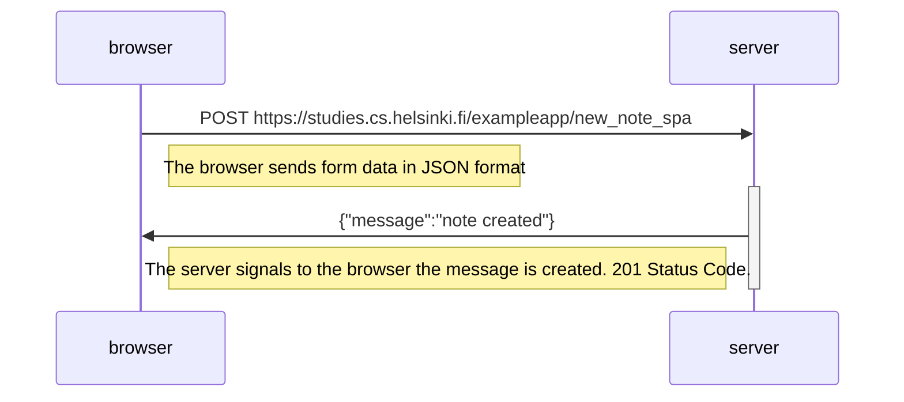

```mermaid

sequenceDiagram
participant browser
participant server

browser ->> server: POST https://studies.cs.helsinki.fi/exampleapp/new_note_spa
Note right of browser: The browser sends form data in JSON format
activate server
server ->> browser:  {"message":"note created"}
Note left of server: The server signals to the browser the message is created. 201 Status Code.
deactivate server
```